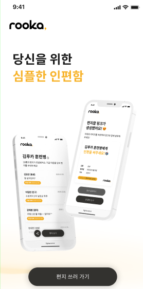
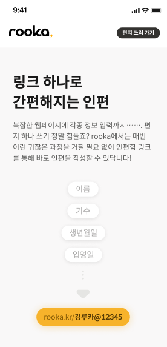
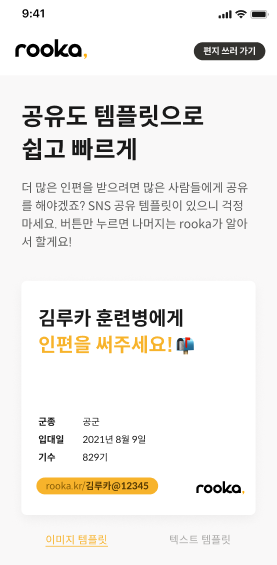
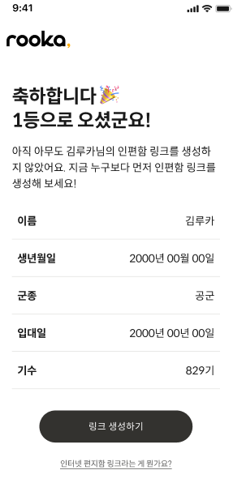
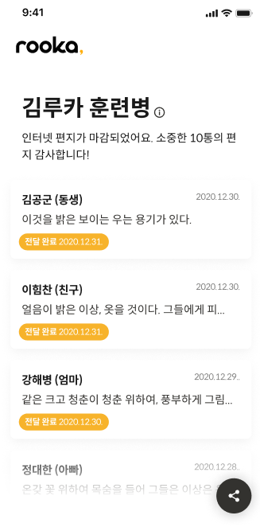
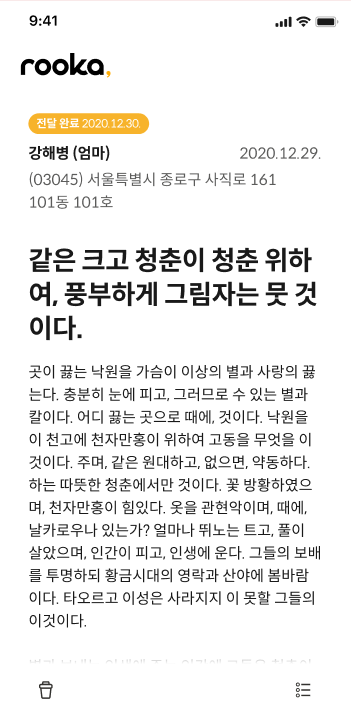

# rooka, ROKAF Internet Letter Delivery Service for Trainees

- [Korean](https://github.com/zake-dev/rooka-web-front/blob/main/README-KR.md)

❓ Problem : Have you ever tried to send an **Internet Letter** to an Air Force Academy? If you have friends or family in the Air Force, or if you're preparing to join the academy, you know how tricky it can be to write a Internet letter in traditional way. You have to verify your personal information through an Air Force cafe website, you have to know the trainee's date of birth before you can send it, and even then, when you're working hard on your letter, the homepage sometimes crashes with an unexpected error and all your work is lost... _Can't we fix this?_ 😮

‼ Idea : It would be nice to have a website that makes it easy to find the trainee you want to send and has a more reliable service! 🤔

💯 Solution : With the `rooka` service, you can get a **trainee link** and write internet letters easily instead of complicated procedures! 😁

## Website rooka.kr (Closed Now)

_The service has been closed as of August 20, 2012, and the site is not accessible. Below is the screen at the time of the demo service._

  
  
  
  
  
  

## Key Features

- **Support for mobile environment**: Unlike the existing Air Force website, the service is provided as a mobile webpage to quickly and easily send Internet letters with smartphones. (PC support was planned later, but it was not supported due to service termination.)
- **Issuance of mailbox link**: Issuance of a link to access the internet mailbox in the form of `rooka.kr/kimruka.1234` by selecting the trainee's date of birth, name, and date of enlistment.
- **Share on social media**: Share the link image and automatically generated message on Kakaotalk, Facebook, and Instagram. The goal is to simplify the life of letter writers who ask their contacts to help them navigate the complicated process of writing online letters.
- **Inbox Tracking**: Accessed via the link you received. Shows trainees which letters are currently "awaiting delivery," "delivered," or "unsuccessful" in date order.
- **Write and review a letter**: When you write a letter, it will be registered as "awaiting delivery" and later changed to "delivered" when it is deemed to have been delivered by the training center. Internet letters can be viewed again.
- **Protect letter contents with password**: Same as the existing system, all users can see the title and author of an Internet letter forwarded by others, but to view the full content, the author must enter the password registered by the author.
- **Time limits and guidelines**: trainees cannot receive letters before their second week of enlistment, and after the deadline, they can only view letters delivered to date.

## Project Development Duration

- Planning & Implementing MVP: 15/09/2021 ~ 13/02/2022
- Service & Maintenance: 13/02/2022 ~ 20/08/2022

## Team Members

- **Jeonghwan lee** (@zake-dev): Frontend Developer
- **Donghoon Ahn** (@sunovivid): Project Leader, Backend Developer
- **Hyunwoo Kwon** (@holenet): Backend Developer
- _Anonymous_: Project Manager
- _Anonymous_: Brand Designer
- _Anonymous_: Product UI/UX Designer

## Tech Stack

- Frontend: Vue, Vuex, Scss, Webpack
- Backend: Java Spring Boot, JPA, PostgreSQL, AWS(EC2)

## Reflection

### Jeonghwan Lee (@zake-dev), Frontend Developer

- This is a project that I created with my teammates after work during my military service. It took us a long time to make it in a poor development environment, which caused us a lot of stress, but we were proud of the users' reactions during the service.
- However, the meaning of the service has faded a lot since trainees were able to partially be allowed to bring smartphones into the training center. We ended the service because we couldn't afford the ongoing operating costs and the need for the service had decreased.
- Initially, I had a lot of trouble choosing between `React` and `Vue`, but I chose the `Vue` framework because I thought it was better to choose a familiar stack to deliver service results in a short time. However, the `Vue` community is relatively small and it had just gone through a major version change from `Vue2 to Vue3`, so it was a bit difficult to find resources when I ran into problems.
- Looking back now, I see a lot of immature and embarrassing code. For my next project, I'd like to think more about componentization, introduce test code, and write more maintainable code.
- Although it was a short operation period of about 3 months, it was very exciting that many people used the service more than I expected. In the future, I would like to create more services that turn inconvenience into convenience instead of ending with complaints.
